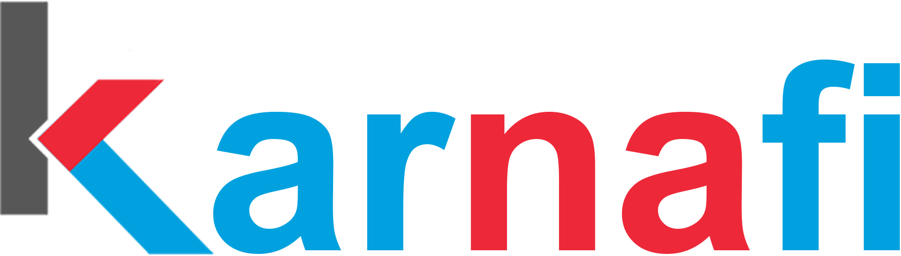

	

  

Karnafi Open provide open source version of all Karnafi apps. Karnafi create technology that doesn't just solve problems, it reshapes what's possible. By combining advanced AI with high tech technology, Karnafi help businesses unlock new levels of efficiency, intelligence, and innovation. Every solution we build aims to reduce complexity, accelerate growth, and empower teams to focus on what truly matters.
  
Karnafi's focus on developer experience isn't just about better tools, it's about enabling people to build smarter systems that minimize environmental impact, streamline energy use, and unlock sustainable innovation. Every solution Karnafi craft aims to make life easier, work more efficient, and the world a little better than before.
  
Karnafi believes in being open, transparent and accountable. Located within the EU (Luxembourg), data privacy is in our DNA.

## Our apps
Kacme: Karnafi's ACME client with highest privacy and security

## Get involved
Right now, open communities are building amazing software together, and there are excellent opportunities, if you're looking to get involved.
- **Contribute to development**: Read our [contributing](../CONTRIBUTING.md) description
- **Review**: Leave us a review on the app store of your choosing
- **Share the love**: Star the Github repo and give us a shout out on social media
<!-- Test New Releases: Visit the community forum for new release canidates and test pre-alpha releases -->
<!-- Help With Translating: Help translate our apps for globalization, see the translator guide to get started -->
<!-- Join Our Community: Join the community forum to discuss feature requests, translations, development, and more -->

## Get started
Visit [https://www.karnafi.com](https://www.karnafi.com?_r=github)

## Find us online